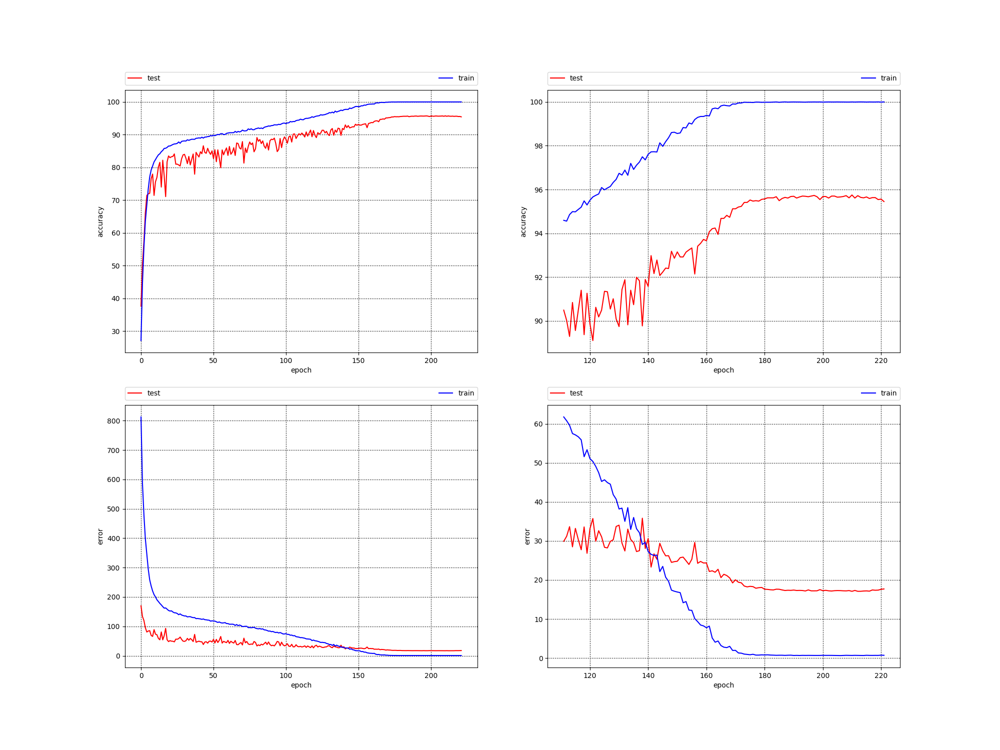
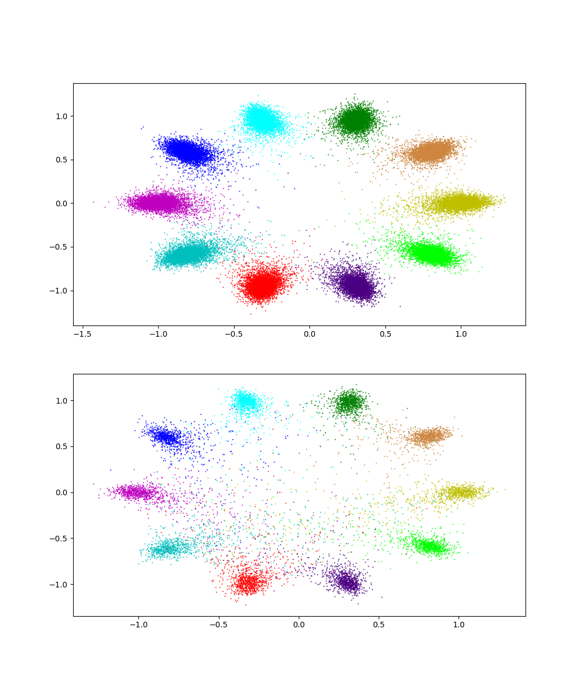
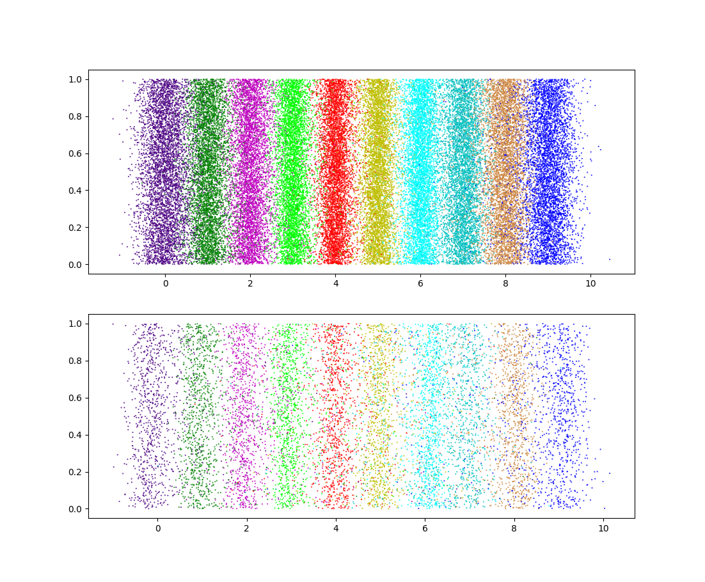
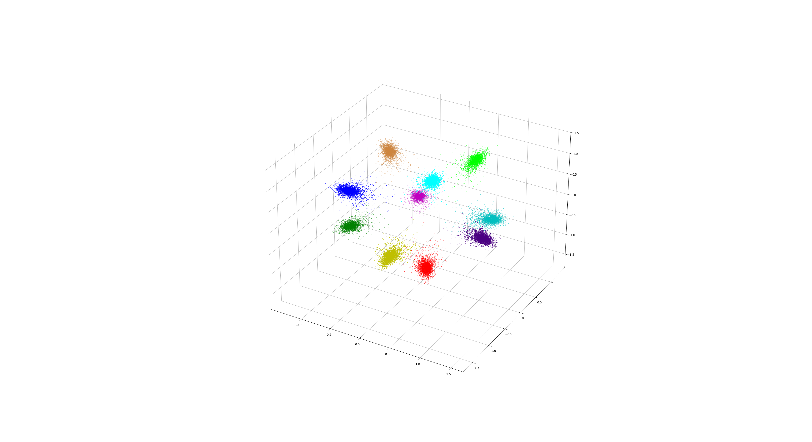
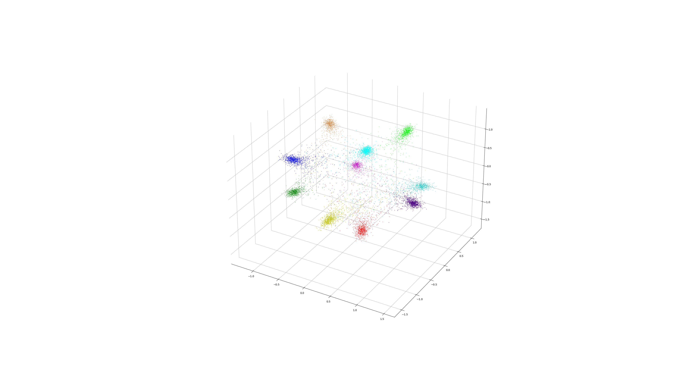

# cifar pytorch

Original script came from [https://github.com/kuangliu/pytorch-cifar](https://github.com/kuangliu/pytorch-cifar)

Results achieved with [densenet121](https://arxiv.org/abs/1608.06993) provided by kuangliu (seems to differ with pytorch's version of densenet):

Max train accuracy: 99.998 %

Max test accuracy: 95.8 %

Min train J: 0.6031531229382381

Min test J: 17.109975514933467

Results for [RESNET18](https://arxiv.org/pdf/1512.03385.pdf):

Max train accuracy: 100.0 %

Max test accuracy: 95.75 %

Min train J: 0.6362376089673489

Min test J: 17.09829800389707

Looking at the features coming out of resnet for training (upper graph) and testing (lower graph) (proc_feats.py):

Or in 1D (proc_feats_1d.py):

And in 3D (proc_feats_3d.py):

Info about system:

Python 3.8.5

GCC 9.3.0

Pytorch 1.7.0+cu110

NVIDIA-SMI 455.38       

Driver Version: 455.38       

CUDA Version: 11.1       

Ubuntu 20.04.1 LTS

GEFORCE RTX 3090
