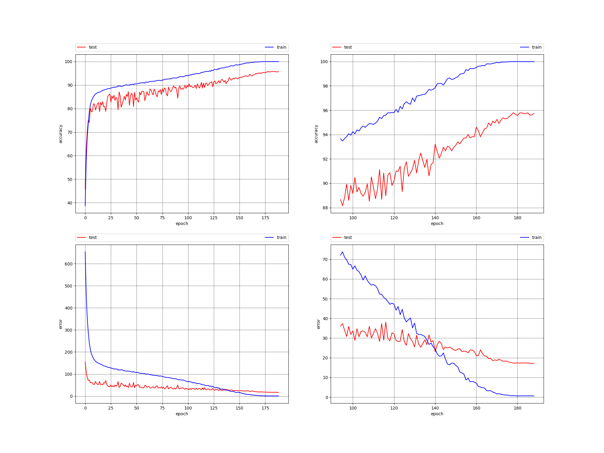

# cifar_pytorch

Original script came from [https://github.com/kuangliu/pytorch-cifar](https://github.com/kuangliu/pytorch-cifar)

Results achieved with [densenet](https://arxiv.org/abs/1608.06993) provided by kuangliu (seems to differ with pytorch's version of densenet):

Max train accuracy: 99.998

Max test accuracy: 95.8

Min train J: 0.6031531229382381

Min test J: 17.109975514933467

Info about system:

NVIDIA-SMI 455.38       

Driver Version: 455.38       

CUDA Version: 11.1       

Ubuntu 20.04.1 LTS

GEFORCE RTX 3090
